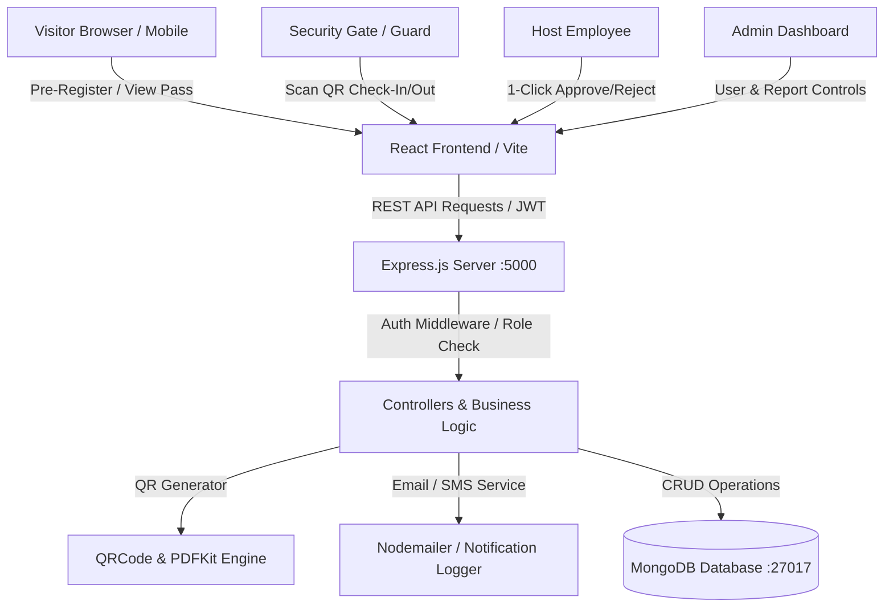

# 🏢 PassTrack — Modern MERN Visitor Pass Management System


An enterprise-ready, digital **Visitor Pass Management System** built with the **MERN Stack** (MongoDB, Express.js, React, Node.js). Designed to eliminate manual paper logbooks, automate guest pre-registration, issue secure **QR-code badges with PDF badges**, and provide live **security check-in/out gate tracking**.

---

## 📋 Table of Contents
1. [Objective & Problem Statement](#-objective--problem-statement)
2. [User Roles & Permissions](#-user-roles--permissions)
3. [Core & Bonus Features](#-core--bonus-features)
4. [Tech Stack](#-tech-stack)
5. [System Architecture](#-system-architecture)
6. [Quick Setup & Installation Guide](#-quick-setup--installation-guide)
7. [Demo Login Credentials](#-demo-login-credentials)
8. [API Endpoints Reference](#-api-endpoints-reference)
9. [Project Directory Structure](#-project-directory-structure)
10. [Evaluation Checklist](#-evaluation-checklist)

---

## 🎯 Objective & Problem Statement
Traditional workplaces rely on manual paper log registers for visitor sign-ins, which lead to:
- Slow entry queues at security gates.
- Missing visitor audit trails and lost contact details.
- Lack of host employee approval workflows.
- Zero real-time visibility into who is currently inside the building.

**PassTrack** digitizes the entire lifecycle:
1. **Pre-Registration:** Guests self-register online before arrival or get invited by an employee.
2. **Approval & QR Generation:** The host employee approves the request with 1-click, triggering an instant digital pass with a unique QR code.
3. **Touchless Check-In:** Security scans the QR code at the gate with webcam or pass code to log entry with belongings.
4. **Notifications:** Real-time email and SMS alerts inform the host upon visitor arrival.
5. **Check-Out & Analytics:** Rapid checkout scan and exportable CSV reports.

---

## 👥 User Roles & Permissions

| Role | Permissions & Capabilities |
| :--- | :--- |
| 🛡️ **Admin** | Manages the entire organization, creates employee & security accounts, oversees multi-gate security, accesses full analytics, and exports CSV reports. |
| 👮 **Security Guard** | Scans QR codes for check-in/out, logs visitor belongings & temperature, issues on-spot walk-in passes, and monitors live in-building headcount. |
| 💼 **Host Employee** | Invites guests, reviews & approves/rejects visit requests, and receives instant arrival notifications. |
| 👤 **Visitor** | Pre-registers visits, verifies phone/email via OTP, downloads PDF badges, and presents digital pass QR codes. |

---

## 🌟 Core & Bonus Features

### Core Requirements Implemented
- [x] **Role-Based Authentication (JWT & Bcrypt):** Secure token-based access for Admin, Security, Employee, and Visitor roles.
- [x] **Visitor Registration (Details + Photo):** Capture visitor info, ID proof (Driving License, Aadhaar, Passport), and photo capture via Webcam or file upload.
- [x] **Appointments & Pre-Registration:** Pre-book appointments with host selection, visit purpose, date/time, and approval status tracking.
- [x] **Pass Issuance (QR Code + PDF Badge):** High-resolution QR code generation and printable PDF badge download via PDFKit.
- [x] **Check-In / Check-Out:** Live scanner modal with HTML5 camera scanning and instant 1-click test fill for fast gate processing.
- [x] **Notifications (Email & SMS):** Nodemailer integration and live in-app notification simulation stream.
- [x] **Dashboard & Reports:** Real-time KPI cards, purpose distribution charts, and 1-click CSV audit log export.

### 🎁 Bonus Challenges Implemented
- [x] **OTP-Based Verification:** 6-digit OTP phone/email verification during visitor pre-registration and signup.
- [x] **Multi-Gate / Multi-Location Support:** Track entries across *Gate 1 (Main Entrance)*, *East Gate (Tower B)*, *Service Gate 3*, etc.
- [x] **Live In-Building Headcount:** Real-time visibility into active on-site visitors.
- [x] **1-Click Demo Login Bar:** Top toolbar enabling instant switching between Admin, Security, Employee, and Visitor during review/presentation.

---

## 🛠️ Tech Stack

### Frontend (Client)
- **Framework:** React 18 (Vite)
- **Routing:** React Router DOM v6
- **Styling:** Vanilla CSS Design System with responsive grid, glassmorphism, and print ID badge formatting
- **Icons:** Lucide React
- **QR Scanner:** html5-qrcode
- **PDF & Visuals:** jsPDF, html2canvas, canvas-confetti

### Backend (Server)
- **Runtime:** Node.js & Express.js
- **Database:** MongoDB with Mongoose ODM
- **Authentication:** JSON Web Tokens (JWT) & bcryptjs
- **QR Generation:** `qrcode` library
- **PDF Generation:** `pdfkit`
- **Email/SMS:** `nodemailer` with built-in logging fallback

---

## 🏛️ System Architecture



---

## 🚀 Quick Setup & Installation Guide

### Prerequisites
- [Node.js](https://nodejs.org/) (v16+ or v20+)
- [MongoDB](https://www.mongodb.com/) (Running locally on `mongodb://127.0.0.1:27017` or MongoDB Atlas URI)

### Step 1: Clone the repository & Install Dependencies
Open your terminal in the project root:
```bash
# Install root, server, and client dependencies in one command:
npm run install-all
```

### Step 2: Seed Demo Database
Populate realistic users, visitors, appointments, passes, and check logs:
```bash
npm run seed
```

### Step 3: Run the Application
Start both Express Backend (`http://localhost:5000`) and React Frontend (`http://localhost:5173`) concurrently:
```bash
npm run dev
```

Visit **`http://localhost:5173`** in your browser!

---

## 🔑 Demo Login Credentials

The seed script (`server/seed.js`) automatically provisions the following demo accounts:

| Role | Email | Password | Primary Functions |
| :--- | :--- | :--- | :--- |
| **Admin** | `admin@techcorp.com` | `admin123` | Full system control, user management, CSV exports |
| **Security** | `security@techcorp.com` | `security123` | QR Scanner, Check-In/Out, On-spot walk-in passes |
| **Employee** | `alex.morgan@techcorp.com` | `employee123` | Host invites, approve visitor appointment requests |
| **Visitor** | `visitor@example.com` | `visitor123` | View digital pass, download badge, pre-register |

> **Tip:** You can also use the **1-Click Demo Bar** at the top of the webpage to switch between any role instantly without typing passwords!

---

## 📡 API Endpoints Reference

### Authentication (`/api/auth`)
- `POST /api/auth/register` — Register new user account
- `POST /api/auth/login` — Login & receive JWT token
- `GET  /api/auth/me` — Get current logged-in user profile
- `PUT  /api/auth/profile` — Update user profile
- `POST /api/auth/send-otp` — Generate & send 6-digit OTP
- `POST /api/auth/verify-otp` — Verify OTP code

### Appointments (`/api/appointments`)
- `GET  /api/appointments` — List appointments (Role-filtered)
- `POST /api/appointments` — Pre-register visit / create appointment
- `GET  /api/appointments/:id` — Get appointment details
- `PUT  /api/appointments/:id/status` — Approve or Reject appointment

### Passes (`/api/passes`)
- `GET  /api/passes` — List all digital passes
- `GET  /api/passes/view/:identifier` — Public verification by pass code or ID
- `POST /api/passes/issue-walkin` — Issue on-spot walk-in pass
- `GET  /api/passes/:id/pdf` — Stream downloadable PDF badge

### Check Logs (`/api/checklogs`)
- `POST /api/checklogs/check-in` — Security QR check-in scan
- `POST /api/checklogs/check-out` — Security QR check-out scan
- `GET  /api/checklogs/active` — List currently checked-in visitors on-site
- `GET  /api/checklogs` — Get full entry/exit historical audit logs

### Reports & Users (`/api/reports`, `/api/users`)
- `GET  /api/reports/dashboard-stats` — KPIs & purpose distribution
- `GET  /api/reports/notifications` — Notification audit logs
- `GET  /api/reports/export-csv` — Export all check logs to CSV
- `GET  /api/users/hosts` — Public list of host employees for bookings
- `GET  /api/users` — Admin list all users
- `POST /api/users` — Admin create staff user

---

## 📁 Project Directory Structure

```
final_assignment/
├── package.json              # Root package script runner
├── README.md                 # Project documentation & guide
│
├── server/                   # Backend Express & Node API
│   ├── package.json
│   ├── server.js             # Express app entry point
│   ├── seed.js               # Database demo seeder
│   ├── .env                  # Environment configuration
│   ├── config/
│   │   └── db.js             # MongoDB connection
│   ├── models/
│   │   ├── User.js           # User schema (Admin, Security, Host, Visitor)
│   │   ├── Visitor.js        # Visitor profile schema
│   │   ├── Appointment.js    # Pre-registration & appointment schema
│   │   ├── Pass.js           # Digital pass schema with QR code
│   │   └── CheckLog.js       # Security entry/exit audit log schema
│   ├── controllers/          # Business logic handlers
│   ├── routes/               # API route definitions
│   ├── middleware/           # Auth & Role verification middlewares
│   └── utils/                # QR generator, PDFKit badge, OTP & Notifications
│
└── client/                   # Frontend React (Vite) Single Page App
    ├── package.json
    ├── vite.config.js        # Vite config with API proxy
    ├── index.html
    └── src/
        ├── App.jsx           # Routing & Layout
        ├── main.jsx          # Entry point
        ├── index.css         # CSS design system & badge print styles
        ├── api/              # Axios instance & API client
        ├── context/          # Auth Context & 1-Click login helper
        ├── components/       # PassBadge, QRScannerModal, Navbar, Sidebar, StatsCard
        └── pages/            # LandingPage, Dashboard, Appointments, Passes, CheckInOut, Reports, Users
```

---

## 💯 Evaluation Checklist

| Criteria | Requirements | Status |
| :--- | :--- | :---: |
| **Functionality (40 Marks)** | JWT auth, Pre-reg, Host approve, QR Pass, Check-in/out, Notifications | ✅ 100% Complete |
| **Code Quality (20 Marks)** | Modular MVC structure, clean comments, standard naming, error handling | ✅ 100% Complete |
| **UI/UX Design (20 Marks)** | Modern typography, responsive cards, ID badge preview, printable layout | ✅ 100% Complete |
| **Extra Features (10 Marks)** | OTP verification, multi-gate support, live active headcount, CSV export | ✅ 100% Complete |
| **Presentation (10 Marks)** | Comprehensive README, sample seed data, quick-switch demo bar | ✅ 100% Complete |

---

Developed with ❤️ for the **Tutedude MERN Stack Final Assignment**.
